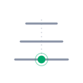
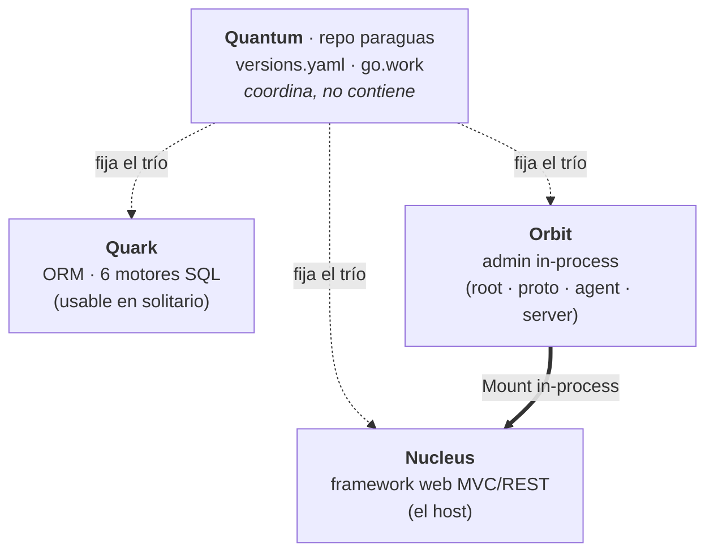

<p align="center">
  <picture>
    <source media="(prefers-color-scheme: dark)" srcset="docs/brand/quantum-mark-dark.svg" />
    
  </picture>
</p>

<p align="center">
  <b><a href="https://jcsvwinston.github.io/quantum/">Documentación de la suite ↗</a></b>
</p>

# Quantum

> **Framework web, ORM y panel de administración para Go: desarrollados por separado, coordinados como suite.**
>
> <sub>Identidad de la suite en [`docs/brand/`](docs/brand/) — concepto "el estado fijado".</sub>

Quantum es la **suite** formada por tres productos Go que se desarrollan por
separado y se presentan, coordinados, como un solo proyecto. El repo `quantum`
es el **paraguas**: *coordina, no contiene*. No aloja el código de los productos
—cada uno vive en su repo con su propia release—, sino que los engancha como
**submódulos git** fijados a un trío de versiones compatibles
([`versions.yaml`](versions.yaml)) y ofrece un `go.work` para desarrollarlos a la
vez en local.

Este README **define el proyecto a través de sus tres submódulos**: qué es cada
uno, qué rol juega en la suite y cómo encajan.

## Los tres pilares

| Pilar | Rol en la suite | Módulo Go | Versión | Submódulo | Uso en solitario |
|---|---|---|---|---|---|
| **Nucleus** | Framework web — el anfitrión | `github.com/jcsvwinston/nucleus` | `v1.21.0` | [`nucleus/`](nucleus) | Sí (base de apps) |
| **Quark** | ORM — la capa de datos | `github.com/jcsvwinston/quark` | `v1.7.1` | [`quark/`](quark) | **Sí, en cualquier app Go** |
| **Orbit** | Admin — monta sobre Nucleus | `github.com/jcsvwinston/orbit` (+ `/proto`, `/agent`, `/server`) | `v1.8.13` | [`orbit/`](orbit) | No (requiere Nucleus) |

Módulos de integración (repo orbit, opt-in; son los que materializan el puente quark↔orbit):

| Módulo | Rol | Versión |
|---|---|---|
| `github.com/jcsvwinston/orbit/quarkbridge` | Publica los statements de Quark en el feed vivo de Orbit | `v0.4.8` |
| `github.com/jcsvwinston/orbit/quarkdatasource` | Expone los modelos Quark en el Data Studio de Orbit | `v0.2.17` |

**¿Por dónde empiezo?** Solo la capa de datos → Quark. Una aplicación → Nucleus (Quark opcional dentro). Los tres juntos → el [ejemplo integrador `showcase_demo`](https://github.com/jcsvwinston/nucleus/tree/main/examples/showcase_demo) los cablea de punta a punta en ~30 minutos, `curl`s incluidos. Orbit siempre requiere Nucleus.

Los nombres vienen de la **física de partículas**: **Nucleus** es el **núcleo** (el
framework anfitrión); **Quark**, la **partícula fundamental** (la capa de datos,
usable suelta); y **Orbit**, lo que **orbita** el núcleo (la administración que
monta sobre Nucleus). **Quantum** los fija como un solo **estado certificado** — un
trío de versiones probadas juntas.

## Cómo encajan

La única dependencia dura entre productos es **Orbit → Nucleus**: Orbit monta
*in-process* dentro de una app Nucleus. **Quark es independiente** —un ORM que se
usa en solitario en cualquier app Go (o como capa de datos de una app Nucleus,
que además trae su propio `pkg/db`)—. La suite los agrupa por *presentación*, no
por acoplamiento (decisión D3 del roadmap).



---

## Nucleus — framework web · submódulo [`nucleus/`](nucleus)

Framework web **MVC/REST** para Go, *stdlib-first*: `net/http`, `database/sql`,
`log/slog` y `context` son el sustrato; el resto se añade detrás de adaptadores
propios del framework para poder sustituirse sin romper el código de la app. Se
distribuye como un único módulo Go con un único binario CLI (`nucleus`) y un
panel de administración React embebido.

- **Runtime stdlib-first** — sin Gin/Chi/Echo, sin GORM/Bun/Ent, sin zap/zerolog
  ([ADR-001](nucleus/docs/adrs/ADR-001-stdlib-first.md)).
- **CLI estilo Django** — decenas de comandos de ciclo de vida (`serve`,
  `migrate`, `createuser`, `inspectdb`, `dumpdata`/`loaddata`,
  `collectstatic`, `makemessages`…), con alias compatibles (`runserver`,
  `makemigrations`, `createsuperuser`, `dbshell`) y flags globales `--json` /
  `--output` para CI.
- **Superficie pública estable por contrato** — paquetes `pkg/app`, `pkg/router`,
  `pkg/model`, `pkg/db`, `pkg/auth`, `pkg/authz`, `pkg/mail`, `pkg/plugins`,
  `pkg/tasks`, `pkg/storage`, `pkg/signals`, `pkg/observe`… clasificados
  `stable`/`transitional`/`experimental` y congelados por tests de contrato.
- **Multi-base de datos** — SQLite, PostgreSQL y MySQL son los carriles
  requeridos; MSSQL y Oracle son exploratorios tras build tags.
- **Multi-tenant y multi-site** — resolución de tenant por subdominio o cabecera,
  aislamiento de BD por tenant, prefijado de storage, rate limiting por tenant.
- **Profundidad operativa** — outbox transaccional con dispatcher por leasing,
  scheduler de tareas (Asynq + Redis), bus de señales con relay opcional por
  Redis, trazas/métricas OpenTelemetry, logging estructurado con correlación, y
  SDK de plugins con envelopes de capacidad.

**Rol en la suite:** es el **anfitrión**. Orbit monta sobre él; las apps de la
suite se construyen sobre `nucleus.New()`.
Enlaces: [repo](https://github.com/jcsvwinston/nucleus) ·
[godoc](https://pkg.go.dev/github.com/jcsvwinston/nucleus) · `SPEC.md` y guías en
[`nucleus/docs/`](nucleus/docs).

---

## Quark — ORM · submódulo [`quark/`](quark)

ORM **type-safe** para Go: usa genéricos en la superficie para acabar con los
casts a `interface{}`, y genera SQL idiomático para **seis motores** por debajo.
Su sello es la seguridad por defecto: cada identificador (columna, tabla,
operador) se valida en el borde de la API antes de tocar el cable.

- **Seis dialectos** — PostgreSQL · MySQL · MariaDB · SQLite · MSSQL · Oracle;
  cambiar de motor es cambiar una línea, sin tocar el código de las queries.
- **SQLGuard** — valida identificadores en la frontera de la API; las raw queries
  son opt-in explícito (`AllowRawQueries`).
- **Query builder inmutable** — clone-on-write, seguro entre goroutines.
- **Multi-tenancy nativa** — `DatabasePerTenant`, `SchemaPerTenant` y
  Row-Level Security (cliente o RLS real de PostgreSQL vía `CREATE POLICY`).
- **Caché L2** — backend enchufable (memoria / Redis) integrado en el ciclo de
  vida de la query, con protección de *stampede*.
- **OpenTelemetry** — trazas y métricas sin cambiar el código de las queries.
- **Operaciones batch**, **eager loading** (`Preload`, sin N+1), **migraciones**
  (auto-`Migrate`/`Sync` + migraciones versionadas, *schema-as-code* con diff por
  introspección), **hooks/eventos/audit log** transaccionales, **read replicas**
  con failover, **sharding**, y una **CLI** (`quark`).

**Rol en la suite:** es el **pilar de datos**, y es **usable en solitario en
cualquier app Go** — `go get github.com/jcsvwinston/quark` es todo lo necesario;
no introduce ninguna dependencia de Nucleus u Orbit. Línea estable `v1.x`.
Enlaces: [repo](https://github.com/jcsvwinston/quark) ·
[docs](https://jcsvwinston.github.io/quark/) ·
[godoc](https://pkg.go.dev/github.com/jcsvwinston/quark).

---

## Orbit — admin · submódulo [`orbit/`](orbit) (multi-módulo)

Producto de **administración** para Nucleus. Es un panel autocontenido que monta
**in-process** en cualquier app Nucleus a través de la API de módulos del
framework: añades una dependencia y una llamada `Mount(orbit.Module(...))`, y
Orbit lee lo que necesita del `Runtime` de la app en marcha y sirve su SPA React
**embebida** — sin sidecar fuera de proceso, sin base de datos propia.

- **Data Studio** — alta/baja/edición de registros para cada modelo del registro
  de la app, tenant-aware, con import/export.
- **Inspector de runtime en vivo** — feed en tiempo real de peticiones HTTP y SQL
  ejecutado (desde el event bus de observabilidad del framework), con agregación
  cross-nodo opcional.
- **Visor de sesiones**, **control de acceso (RBAC Casbin)**, **métricas de
  sistema** (CPU, memoria, goroutines, pool de BD), **audit log** y vistas de
  **overview/health**.

Es **multi-módulo** (de ahí las entradas extra en el `go.work`): la mayoría de
apps solo necesitan el módulo raíz; los otros tres habilitan observabilidad de
flota (*cluster*):

| Módulo | Rol |
|---|---|
| [`orbit/`](orbit) (raíz) | Panel de admin in-process montado en la app Nucleus. |
| [`orbit/proto`](orbit/proto) | Contrato Connect-RPC + stubs generados (Go y TypeScript). |
| [`orbit/agent`](orbit/agent) | Agente in-process que embebe en cada proceso del framework y envía eventos a un servidor de admin por un stream bidi. |
| [`orbit/server`](orbit/server) | Binario de servidor de admin independiente que recibe esos eventos y sirve la UI. |

**Rol en la suite:** es el **admin** que monta sobre Nucleus; **depende de
Nucleus**. Se extrajo del core del framework
([Nucleus ADR-019](https://github.com/jcsvwinston/nucleus/blob/main/docs/adrs/ADR-019-extract-admin-to-orbit-module.md))
como ruptura limpia — Nucleus ya no incluye código de admin.
Enlaces: [repo](https://github.com/jcsvwinston/orbit) ·
[godoc](https://pkg.go.dev/github.com/jcsvwinston/orbit).

---

## El modelo paraguas

El repo `quantum` **coordina, no contiene**. La analogía es una distro de Linux:
no incluye el código de cada paquete, publica un manifiesto de qué versiones,
probadas juntas, forman una release. Lo que **sí** hace: declara conjuntos
compatibles ([`versions.yaml`](versions.yaml)), da un `go.work` de desarrollo
cruzado y —en fases siguientes— alojará el sitio de docs unificado. Lo que **no**
hace: no absorbe el código, no decide las subversiones de cada producto, ni
condiciona que `go get github.com/jcsvwinston/quark` siga funcionando para
cualquiera. Razonado en [QADR-0001](docs/adr/QADR-0001-multirepo-paraguas.md).

## Versionado en dos niveles

- **Cada módulo** mantiene su propio SemVer y cadencia (las versiones reales que
  la gente instala).
- **La suite** tiene su propio SemVer, que es el del *manifiesto*, no el de
  ningún módulo. Las subversiones flotan entre releases Quantum; los majors solo
  se cruzan en una release Quantum coordinada (a partir de Quantum 1.0).

El número Quantum nunca sustituye al `vX.Y.Z` real de cada módulo. Detalle en
[QADR-0002](docs/adr/QADR-0002-versionado-dos-niveles.md).

## Trabajar con los submódulos

```bash
git clone --recurse-submodules https://github.com/jcsvwinston/quantum.git
cd quantum

# Compila el trío fijado. El root del workspace no es un módulo Go, así que se
# pasa un patrón explícito por cada módulo del go.work — los diez: un módulo
# anidado (showcase_demo, providers/ldap, quarkbridge…) es un módulo aparte y
# NO lo cubre el patrón de su padre (./nucleus/... compila 1 de los 3 módulos
# de nucleus y sale igualmente con EXIT=0):
go build ./quark/... \
  ./nucleus/... ./nucleus/examples/showcase_demo/... ./nucleus/providers/ldap/... \
  ./orbit/... ./orbit/agent/... ./orbit/proto/... ./orbit/quarkbridge/... \
  ./orbit/quarkdatasource/... ./orbit/server/...
```

El `go.work` es una conveniencia de desarrollo: **no se publica** como dependencia
y no tiene equivalente `replace` en los `go.mod` de los productos. En release,
cada módulo resuelve sus dependencias por tag real.

> **Nota sobre los pines.** Desde Quantum 0.3.0 los tres submódulos se fijan
> a sus tags publicados (`workspace_pins` = `modules` en `versions.yaml`);
> desde Quantum 1.0.0 los tres pilares están en major 1 y rige el régimen de
> majors en lockstep. Los sets Quantum 0.1.0–0.5.0 se certificaron solo como
> commits del manifiesto, sin tag git: los tags de suite existen desde
> `v1.0.0`. Ver
> [QADR-0004](docs/adr/QADR-0004-versions-yaml-manifiesto.md) y
> [QADR-0002](docs/adr/QADR-0002-versionado-dos-niveles.md).

> **Nota para construir `website/`.** Usa checkouts reales de los submódulos
> (`git clone --recurse-submodules` o `git submodule update --init --recursive`),
> no symlinks: el loader de metadatos de Docusaurus no resuelve las docs de los
> productos a través de un symlink y el build del SSG falla con
> `content.metadata.id` de `undefined`. El CI ya construye así
> (`submodules: recursive`).

## Un `.env`, dos gramáticas de configuración

Quark lee `QUARK_*` (viper, anidado con `_`) y Nucleus lee `NUCLEUS_*`
(koanf, anidado con `__`). Una app que usa ambos no necesita mantener dos
juegos de variables: [`scripts/quantum-env.sh`](scripts/quantum-env.sh)
traduce un `.env` neutro a las dos gramáticas a la vez.

```bash
eval "$(scripts/quantum-env.sh .env)"
```

Claves neutras entendidas: `DATABASE_URL` (→ DSN de quark **y** URL de
nucleus), `DATABASE_DRIVER`, `ADMIN_DATABASE_URL`, `REDIS_URL`,
`JWT_SECRET`, `LOG_LEVEL`, `TENANT_STRATEGY`, `TENANT_DSN_TEMPLATE`. Todo
lo demás pasa sin tocar, así que un `.env` existente sigue funcionando.
También puede materializar un fichero: `scripts/quantum-env.sh .env > both.env`.

## Documentación

- [`docs/RUMBO.md`](docs/RUMBO.md) — el roadmap **vivo**: estado real y frentes abiertos.
- [`docs/ROADMAP.md`](docs/ROADMAP.md) — plan de convergencia por fases (histórico, cerrado 2026-07-11).
- [`docs/adr/`](docs/adr/) — decisiones de arquitectura de la suite (QADR).
- Sitio de docs unificado: **vivo** en
  [jcsvwinston.github.io/quantum](https://jcsvwinston.github.io/quantum/) —
  ensambla las docs de los tres productos (la fuente vive en cada repo,
  QADR-0003) con doble selector de versión y búsqueda local.

## Licencia

[Apache-2.0](LICENSE), alineada con los tres productos. Cada uno conserva la
licencia de su propio repositorio.
